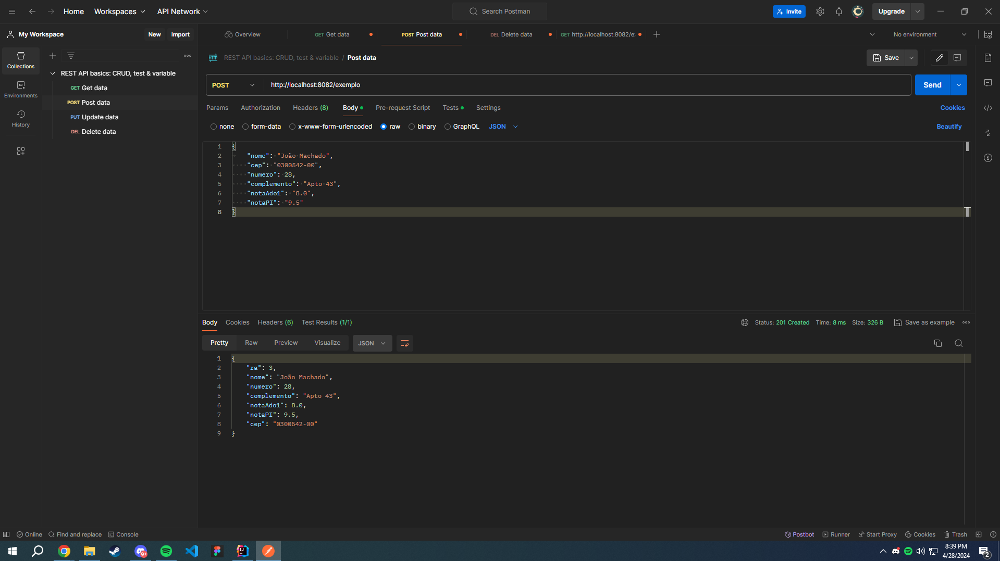
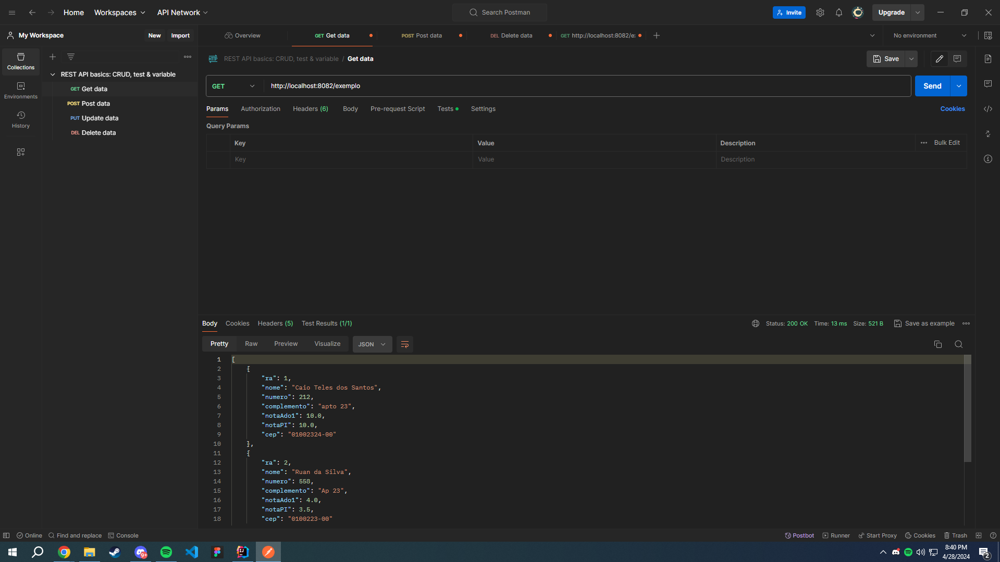
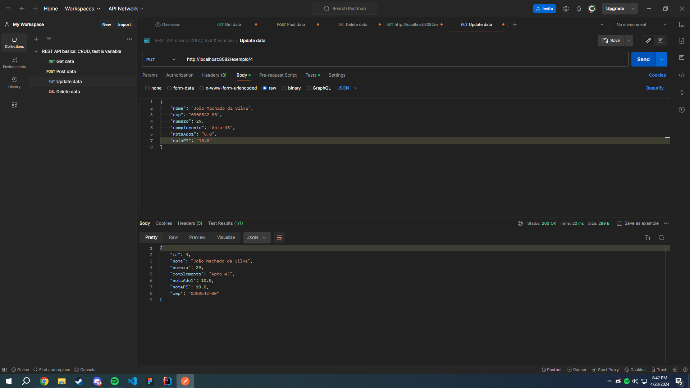
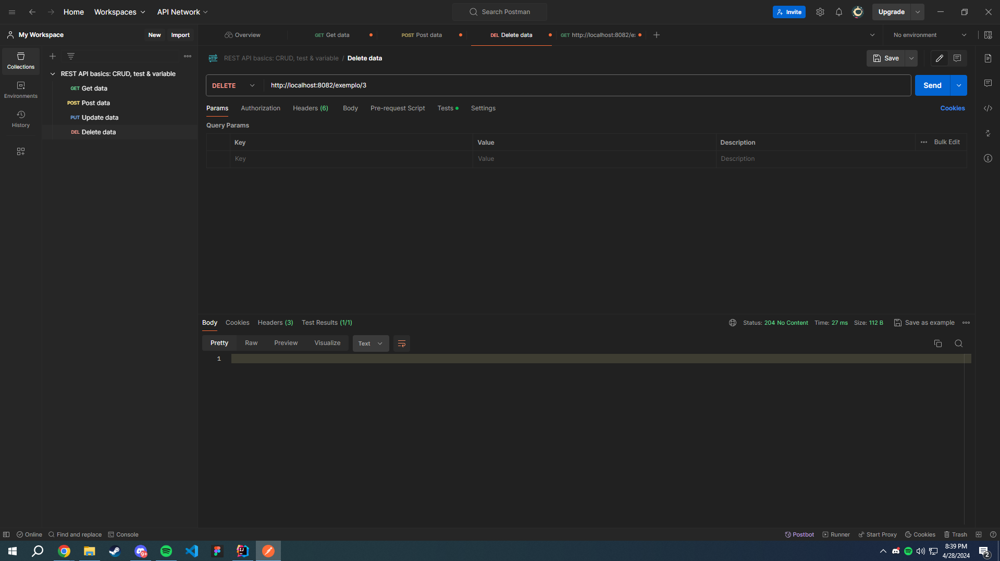

# Projeto Spring Boot CRUD (PT-BR)

Este é um projeto simples desenvolvido utilizando o Spring Boot, que permite realizar operações CRUD (Create, Read, Update, Delete) em uma entidade de Alunos.

## Objetivo

O objetivo deste projeto é demonstrar como criar uma aplicação CRUD básica utilizando o Spring Boot, e testá-la utilizando o Postman.

## Tecnologias Utilizadas

- Spring Boot
- Postman

## Exemplos de Operações CRUD

### Create (POST /alunos)

### Read (GET /alunos)

### Update (PUT /alunos/{id})

### Delete (DELETE /alunos/{id})

  
#
# Simple Spring Boot CRUD Project (EN)

This is a simple project developed using Spring Boot, which allows performing CRUD (Create, Read, Update, Delete) operations on a Students entity.

## Objective

The objective of this project is to demonstrate how to create a basic CRUD application using Spring Boot, and test it using Postman.

## Technologies Used

- Spring Boot
- Postman